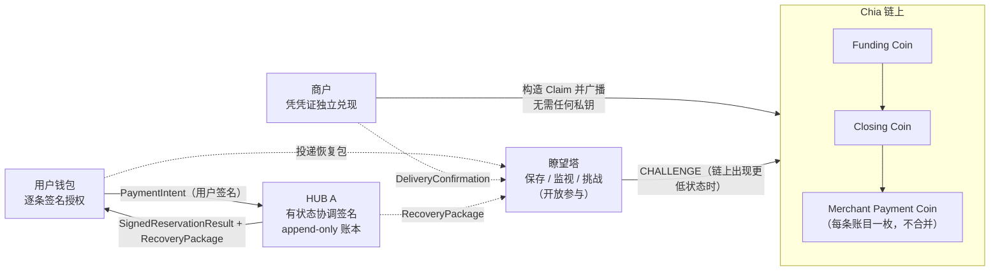

# XHUB

> 基于 Chia 原生原语（CLVM、coin lineage、BLS 聚合签名、绝对/相对高度断言）构建的**非托管小额支付通道**协议与参考实现。

[](LICENSE)

**一句话定位**：商户在用户与 HUB 双双离线时，仍能凭一份已签名的链下凭证独立在链上兑现收款；而用户始终保有一条不需要任何人配合的全额退出路径。

- **协议层**：X-Hub V3.6（用户逐条授权 + HUB 单一有状态协调签名 + 开放瞭望塔保存与挑战 + 任意第三方关闭和广播）
- **实现语言**：Rust（五个独立 crate）+ 一个三端共用的网页前端
- **许可**：[Apache-2.0](LICENSE)，第三方归属见 [NOTICE](NOTICE)

---

## 一、它解决什么问题

Chia 的手续费接近零、区块也远未满，所以 XHUB **不是为了省手续费**。它解决的是链上支付在**支付语义与确定性**上的三个硬缺口：

| 缺口 | 链上直接转账 | XHUB |
|---|---|---|
| 确认时延 | 商户必须等出块（约数十秒）才能确认收款 | 链下签名即达 `DELIVERED`，商户可立即交付商品 |
| 拒付/反悔 | 交易一旦上链即终局，但链下赊账无强制力 | 预扣（reservation）由用户逐条签名 + HUB 协调签名，**不可撤销**，天然无拒付 |
| 离线兑现 | 付款人离线，收款人无法推进 | 商户凭完整 RecoveryPackage 可**独立**构造 Claim 并广播 |

同时，通道把"高频小额"从链上 UTXO 集合中挪走：避免大量小额 coin 的产生与合并、避免依赖 mempool 在拥堵时接受 0 费交易、避免每一笔都要等待确认深度。这是**时延确定性与支付语义**的问题，不是手续费问题。

## 二、为什么必须是 Chia 原语

XHUB 的安全性不来自任何新的信任假设，而来自 Chia 本身就有的东西：

- **coin lineage**：Funding Coin → Closing Coin → Merchant Payment Coin 的谱系由 coin ID 严格绑定，链上可独立验证，不需要全局状态。
- **CLVM 纯函数验证**：通道条款、账本根、金额守恒、找零地址全部在 puzzle 内验证，链下各方可以各自复算并得到同一结果。
- **BLS 聚合签名**：用户逐条授权签名 + HUB 状态签名可聚合进一个 SpendBundle，链上只验证一次聚合签名。
- **绝对/相对高度断言**：接受期、冻结期、挑战期、关闭延迟全部由高度断言强制执行，不依赖任何参与方"守规矩"。
- **任意第三方可广播**：关闭与挑战分支对广播者身份无要求——这是 Chia UTXO 模型天然赋予的，也是 XHUB 抗 HUB 消失的基础。

## 三、核心特性

- **非托管**：HUB 只做状态验证、排序与协调签名，其签名**不能代替**用户付款签名；用户找零地址在创建 Funding Coin 时即固定不可改。
- **逐条授权**：每一笔付款都必须有用户对该笔的独立签名，HUB 不得批量代签。
- **Append-only 账本**：更高状态只能追加，不得删除、修改或重排旧记录。
- **幂等预扣**：幂等键为 `(funding_coin_id, reservation_nonce)`；内容冲突返回 `NonceConflict` 而非签出第二份冲突结果。
- **一次性请求码**：跨全部 Funding Coin 全局唯一，一个请求码只能被一个通道消费一次（守卫已实现于 HUB 与钱包两端）。
- **开放瞭望塔**：任何人可运行；生产绿灯推荐"一份有效商户回执 + 跨故障域 `2-of-3` 托管证明"。同一 VPS 上的多个实例只算一个故障域。
- **独立退出**：没有正式预扣时，State 0 走完挑战流程后资金全部返回用户，不设独立退款高度。

## 四、架构



**五个 Rust crate**（V3.6 主线，评审状态 `REVIEWED`）：

| Crate | 职责 |
|---|---|
| `V3.6/protocol-v3_6` | 协议类型、规范编码、哈希域、BLS 签名、Merkle 规则、golden vectors |
| `V3.6/puzzles-v3_6` | Funding / Initial Closing / Subsequent Closing / Merchant Payment 四个 CLVM puzzle |
| `V3.6/hub-v3_6` | 有状态签名器、append-only 账本、reservation 幂等核心、SQLite 持久化与故障恢复 |
| `V3.6/watchtower-v3_6` | RecoveryPackage 接收与完整验证、商户回执校验、托管证明聚合、只读链监控 |
| `V3.6/wallet-v3_6` | 钱包库、HTTP API、三端共用的网页前端（`web/`） |

根目录的 `wall-hub-mvp` crate 是**早期一次性单向通道原型**（v1/v2），已冻结并保留作为论证证据，其原始英文说明存档于 [`docs/legacy-README-stage-abc.en.md`](docs/legacy-README-stage-abc.en.md)。

## 五、协议参数（V3.6 默认值）

```text
protocol_version          = u16_be(0x0360)
acceptance_blocks         = 12288     # 预扣接受期
freeze_blocks             = 200       # 冻结期
close_delay_blocks        = 12488     # = acceptance + freeze，只读派生，不可单独编辑
challenge_blocks          = 6000      # 挑战期（候选主网默认值，尚未证明为安全下限）
max_ledger_entries        = 64
funding 确认深度          = 32
```

这四个值在创建 Funding Coin 时由用户确认并承诺进 `channel_terms_hash`，创建后**不可修改**。钱包、HUB 与 Funding Puzzle 各自独立重新校验，互不信任。

## 六、安全模型：保证什么，不保证什么

**保证**

- 未经用户签名的付款不能进入最终输出；
- 商户地址、金额、nonce 不能被 HUB 或瞭望塔修改；
- 用户找零只能发往创建时固定的地址；
- 已进入正式状态的账目不能被后续更高状态删除；
- 任意人可发起关闭、提交更高状态挑战、完成最终结算；
- 仅凭高序号 checkpoint 而无完整账本数据者，不能锁死 Closing Coin。

**明确不保证**

- HUB A 私钥泄露后不会产生冲突状态；
- 尚未取得正式签名的 PENDING 请求一定成功；
- 未传播的恢复包能在 HUB 消失后恢复；
- 所有持有最新状态的参与者同时离线时仍能及时挑战；
- 链上拥堵或缺少 fee sponsor 时仍能及时广播。

## 七、当前状态（请如实阅读）

这是一个**工程与密码学证据完整、但尚未获准广播**的项目。

| 项 | 状态 |
|---|---|
| 五个 V3.6 crate 的 `cargo test` / `clippy -D warnings` / `fmt --check` | ✅ 通过（`REVIEWED`） |
| 协议规范、golden vectors、冻结清单 | ✅ `VECTOR_READY` |
| 早期 v1/v2 原型的主网 10 mojo Claim / Refund 实测 | ✅ 真实主网 PASS（1 + 9 mojo / 10 mojo，0 fee） |
| V3.6 主网 10 mojo 实验 | ⚠️ 未审计实验，`mainnet_approved = false` |
| 广播能力 | 🔒 `broadcast_enabled` / `broadcast_ready` / `chain_broadcast` **恒为 `false`** |
| 主网参数冻结、KMS/HSM、跨 VPS 复制、真实 TLS 端点、独立外部安全评审 | ⬜ `OPEN` |

代码库中的 `broadcast_*` 三个字段由**数据库约束**固定为 `false`：瞭望塔可以构造并完整验证 CHALLENGE SpendBundle、可以走完"离线准备 → 双人跨故障域审批 → 最终链上重检 → 执行清单 → 授权闸门"的全流程审计链，但**不保存 SpendBundle 字节、不持有私钥、不提供 `push_tx` 或广播端点**。这是刻意的设计，不是待办。

> **这里说的"广播"是专有含义**，特指**瞭望塔发起 CHALLENGE 交易并调用 `push_tx` 上链**，不等于"产品主网上线"。用户创建 Funding Coin、商户凭已签名凭证结算，都由各自的钱包/商户端发起并由人确认，**不受此约束**。被锁死的是唯一一个"由软件自动决策、可单方面改写链上状态"的动作。

## 八、快速开始

前置：Rust stable；可选 `clvm_tools_rs 0.4.0`（用于早期原型的 CLVM 编译）。

```bash
# V3.6 全量回归（离线）
cargo test --offline --all-targets --manifest-path V3.6/protocol-v3_6/Cargo.toml
cargo test --offline --all-targets --manifest-path V3.6/hub-v3_6/Cargo.toml
cargo test --offline --all-targets --manifest-path V3.6/watchtower-v3_6/Cargo.toml

# 重新生成 golden vectors
cargo run --offline --manifest-path V3.6/protocol-v3_6/Cargo.toml --bin generate-vectors
cargo run --offline --manifest-path V3.6/hub-v3_6/Cargo.toml --bin generate-hub-vectors

# 瞭望塔：一次只读链监控轮询（不广播、不创建 SpendBundle）
cargo run --offline --manifest-path V3.6/watchtower-v3_6/Cargo.toml \
  --bin watchtower-monitor-v3-6 -- <WATCHTOWER_DB> <RPC_URL> <FUNDING_COIN_ID>
```

早期原型的一键演示（Windows）：

```powershell
powershell -NoProfile -ExecutionPolicy Bypass -File .\scripts\demo-day7.ps1
```

安全门禁（格式化、锁定测试、Clippy、CycloneDX SBOM）：

```powershell
powershell -NoProfile -ExecutionPolicy Bypass -File .\scripts\security-check.ps1
```

HTTP 接口固定使用 `/api/v3.6` 前缀与 `x-xhub-protocol-version: 0x0360` 请求头，详见 [`V3.6/hub-v3_6/HTTP-API.md`](V3.6/hub-v3_6/HTTP-API.md) 与 [`V3.6/watchtower-v3_6/README.md`](V3.6/watchtower-v3_6/README.md)。

## 九、文档索引

**V3.6 主线**

- [`V3.6/protocol-v3_6/protocol-v3_6.md`](V3.6/protocol-v3_6/protocol-v3_6.md) — 协议书（规范）
- [`V3.6/protocol-v3_6/IMPLEMENTATION-SPEC.md`](V3.6/protocol-v3_6/IMPLEMENTATION-SPEC.md) — 实现规范
- [`V3.6/protocol-v3_6/FREEZE-CHECKLIST.md`](V3.6/protocol-v3_6/FREEZE-CHECKLIST.md) — 冻结清单
- [`V3.6/hub-v3_6/README.md`](V3.6/hub-v3_6/README.md) — HUB 不变量、持久化顺序、链状态门控
- [`V3.6/hub-v3_6/HTTP-API.md`](V3.6/hub-v3_6/HTTP-API.md) — HUB HTTP API
- [`V3.6/watchtower-v3_6/README.md`](V3.6/watchtower-v3_6/README.md) — 瞭望塔、审批链、备份恢复
- [`V3.6/mainnet-experiment/README.md`](V3.6/mainnet-experiment/README.md) — 主网 10 mojo 实验说明
- [`V3.6/release/README.md`](V3.6/release/README.md) — 测试网发布清单

**早期原型（v1/v2）**

- [`docs/protocol-v1.md`](docs/protocol-v1.md)、[`docs/protocol-v2.md`](docs/protocol-v2.md) — 协议与二进制编码
- [`docs/state-machine-v1.md`](docs/state-machine-v1.md) — 生命周期与错误语义
- [`docs/WALL_HUB_7_DAY_MVP_SUMMARY_ZH.md`](docs/WALL_HUB_7_DAY_MVP_SUMMARY_ZH.md) — 七天 MVP 中文论证总结
- [`docs/mainnet-10mojo-test-report-2026-08-03-zh.md`](docs/mainnet-10mojo-test-report-2026-08-03-zh.md) — 主网 10 mojo 实测报告
- [`docs/stage-c-hardening.md`](docs/stage-c-hardening.md)、[`docs/stage-c-audit-closure.md`](docs/stage-c-audit-closure.md) — 工程加固与审计收口

## 十、路线图

1. **主网参数冻结**：`acceptance_blocks` / `freeze_blocks` / `challenge_blocks` 的安全下限经测试与安全评审后冻结（当前 `challenge_blocks = 6000` 仅为候选默认值）。
2. **独立外部安全评审**：CLVM puzzle、账本状态机、审批与审计链。
3. **跨故障域真实部署**：三个独立运营者的瞭望塔、真实 TLS/mTLS 端点、跨 VPS 加密备份复制。
4. **KMS/HSM 密钥托管**：HUB A 与瞭望塔证明密钥的托管、轮换与销毁。
5. **广播审批（仅指瞭望塔 CHALLENGE 上链）**：在完成以上全部项后，才可能解除数据库层 `broadcast_*` 约束，允许瞭望塔真正把 CHALLENGE SpendBundle 提交到 Chia 网络。日常的锁币、预扣、结算**不依赖**这一步；但"HUB 消失后已传播状态仍可结算""没有正式预扣时资金全部返回用户"这两条安全承诺，最终要靠这条挑战路径在链上强制执行——所以它一日未解锁，项目就不能宣称生产就绪。

## 十一、许可证

Apache License 2.0，见 [LICENSE](LICENSE)。第三方组件归属见 [NOTICE](NOTICE)。

> "QR Code" 是 DENSO WAVE INCORPORATED 的注册商标。
