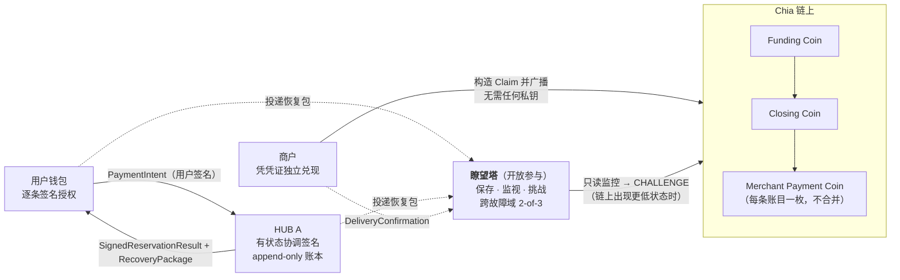
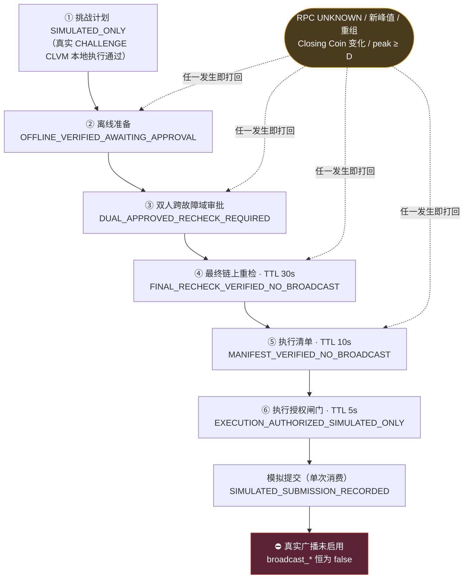

# XHUB

> 基于 Chia 原生原语（CLVM、coin lineage、BLS 聚合签名、绝对/相对高度断言）构建的**非托管小额支付通道**协议与参考实现。

[](LICENSE)

**一句话定位**：商户在用户与协调方双双离线时，仍能凭一份已签名的链下凭证独立在链上兑现收款；而用户始终保有一条不需要任何人配合的全额退出路径。**全程没有任何一方托管你的钱。**

- **协议层**：X-Hub V3.6（用户逐条授权 + HUB 单一有状态协调签名 + **开放瞭望塔**保存与挑战 + 任意第三方关闭和广播）
- **实现语言**：Rust（五个独立 crate，其中瞭望塔 12,007 行）+ 一个三端共用的网页前端
- **许可**：[Apache-2.0](LICENSE)，第三方归属见 [NOTICE](NOTICE)

### 60 秒版本

Chia 上一笔转账的费用常年接近零，但你还是很难用它买一杯咖啡——因为**商户要等出块才敢确认收款，而且没有任何机制阻止顾客事后反悔**。

XHUB 是一条基于 Chia 原生 CLVM 构建的非托管小额支付通道。顾客打开通道、扫码、**逐笔授权**；商户当场拿到一份不可撤销的收款凭证，可以立刻交付商品。即便顾客和协调方此后全部离线，商户仍能凭这份凭证**独立**在链上把钱取走。反过来，顾客随时可以退出，不需要任何人的配合或许可。

它填补的不是"更便宜的转账"，而是 **Chia 上目前缺失的那一层：可被真实商户使用的收款语义**。

---

## 一、它带来什么价值

### 1.1 三方各得到什么

| | 现在的状况 | 有了 XHUB |
|---|---|---|
| **商户** | 必须等出块确认（Chia 出块约 52 秒，且不是每个区块都打包交易），高峰期更久 | 链下签名即确认，**当场交付** |
| **商户** | 信用卡通道要付 1.5–3% 手续费，还要承担拒付（chargeback）与 T+N 结算 | 预扣由付款人亲笔签名，**不可撤销**，天然无拒付；结算在自己手里 |
| **商户** | 想用链上方案就得把资金放进共享池，承担合约与托管风险 | **没有共享池、没有合约托管**，每个通道独立 |
| **用户** | 托管钱包或"无限授权"模式，一旦服务端出事就是全额损失 | **逐笔授权**，钱始终在自己通道的 coin 里 |
| **用户** | 中间协调方跑路就没了 | 协调方**只做排序与协调签名，不能动钱**；开放瞭望塔可独立抗辩 |
| **Chia 生态** | Cloud Wallet 已支持买币与 Vault，"能花的地方"仍然缺位 | 补上**消费级支付**这一环，给 XCH 一个真实的支出场景 |

### 1.2 为什么这对 Chia 特别重要

Chia 从 2021 年白皮书起就在讲支付轨道、托管与跨境结算，官方也在 2025 年 10 月把 Cloud Wallet 推到了正式发布（支持 ACH 买币与 Vault）。但生态里一直缺一件东西：**一个能被真实商户使用的支付协议**。

手续费低到近乎为零，意味着**微支付在经济上是可行的**——问题从来不是成本，而是**没有轨道**。XHUB 就是那条轨道。

### 1.3 对行业的影响：为什么这条路值得走

**① 非托管是合规成本最短的一条路。**
XHUB 里没有任何一方持有用户资金：HUB 只做状态验证与协调签名，瞭望塔不持有任何私钥，用户的钱始终锁在自己创建时固定的 coin 里。这意味着商户和服务商**不必走"托管方"那套牌照与审计路径**。对一家把自身定位成"受监管市场的金融基础设施"的公司来说，这一点比技术本身更重要。

**② "不共享池"不是一个保守选择，是被验证过的选择。**
据 XCH.today 报道，2026 年 8 月 Chia 生态在一周内就有三家 DeFi 出事：warp.green 被利用、TibetSwap 主动抢救流动性、CircuitDAO 国库被掏空。它们的共同点是**共享流动性池 + 合约托管**——攻击一次，损失是整个池子。

XHUB 走的是相反的路：账本是**每通道独立的 append-only 记录**，没有全局池、没有可被掏空的国库、没有 custodial 合约。攻击面从"一份被广泛复用的合约代码"退回到"单个用户对单笔付款的签名"。损失上限天然被限制在单个通道内。

**③ 它给"watchtower 该怎么做"提供了一个不同的答案。**
比特币闪电网络的瞭望塔通常是**付费订阅、需要你信任它会在关键时刻出面**的服务。XHUB 的瞭望塔是**开放参与的抗辩网络**：任何人都能跑，挑战权来自你手上的完整数据而不是你的身份；更关键的是它按**故障域**计数——同一台机器、同一个运营者、同一条上游链路上的多个实例只算一份，防止"三个副本"退化成一个故障点。

**④ 它证明 coin-set 模型能做的事比想象中多。**
Chia 没有 EVM。XHUB 展示的是：仅靠 coin lineage、CLVM、BLS 聚合签名和高度断言这四样 Chia 原生的东西，就能做出完整的支付通道语义，而且链上验证是**纯函数、无全局状态**的。这对"Chia 上能建什么"是一个可以复用的范例，而不只是一个应用。

**⑤ 它以 Apache-2.0 开源，可作为公共品复用。**
协议规范、参考实现、golden vectors、冻结清单全部公开。任何钱包或商户系统都可以照着独立实现并互操作——不需要许可，也不需要信任本项目的运营者。

## 二、它解决什么问题（技术动机）

Chia 的手续费接近零、区块也远未满，所以 XHUB **不是为了省手续费**。它解决的是链上支付在**支付语义与确定性**上的三个硬缺口：

| 缺口 | 链上直接转账 | XHUB |
|---|---|---|
| 确认时延 | 商户必须等出块才能确认收款 | 链下签名即达 `DELIVERED`，商户可立即交付 |
| 拒付/反悔 | 交易一旦上链即终局，但链下赊账无强制力 | 预扣由用户逐条签名 + HUB 协调签名，**不可撤销** |
| 离线兑现 | 付款人离线，收款人无法推进 | 商户凭完整 RecoveryPackage 可**独立**构造 Claim 并广播 |

同时，通道把"高频小额"从链上 UTXO 集合中挪走：避免大量小额 coin 的产生与合并、避免依赖 mempool 在拥堵时接受 0 费交易、避免每一笔都要等待确认深度。这是**时延确定性与支付语义**的问题，不是手续费问题。

## 三、为什么必须是 Chia 原语

XHUB 的安全性不来自任何新的信任假设，而来自 Chia 本身就有的东西：

- **coin lineage**：Funding Coin → Closing Coin → Merchant Payment Coin 的谱系由 coin ID 严格绑定，链上可独立验证，不需要全局状态。
- **CLVM 纯函数验证**：通道条款、账本根、金额守恒、找零地址全部在 puzzle 内验证，链下各方可以各自复算并得到同一结果。
- **BLS 聚合签名**：用户逐条授权签名 + HUB 状态签名可聚合进一个 SpendBundle，链上只验证一次聚合签名。
- **绝对/相对高度断言**：接受期、冻结期、挑战期、关闭延迟全部由高度断言强制执行，不依赖任何参与方"守规矩"。
- **任意第三方可广播**：关闭与挑战分支对广播者身份无要求——这是 Chia UTXO 模型天然赋予的，也是 XHUB 抗 HUB 消失的基础。

## 四、核心特性

- **非托管**：HUB 只做状态验证、排序与协调签名，其签名**不能代替**用户付款签名；用户找零地址在创建 Funding Coin 时即固定不可改。
- **逐条授权**：每一笔付款都必须有用户对该笔的独立签名，HUB 不得批量代签。
- **Append-only 账本**：更高状态只能追加，不得删除、修改或重排旧记录。
- **幂等预扣**：幂等键为 `(funding_coin_id, reservation_nonce)`；内容冲突返回 `NonceConflict` 而非签出第二份冲突结果。
- **一次性请求码**：跨全部 Funding Coin 全局唯一，一个请求码只能被一个通道消费一次（守卫已实现于 HUB 与钱包两端）。
- **开放瞭望塔**：任何人可运行；生产绿灯推荐"一份有效商户回执 + 跨故障域 `2-of-3` 托管证明"。详见[第六章](#六瞭望塔watchtower非托管的最后一块拼图)。
- **独立退出**：没有正式预扣时，State 0 走完挑战流程后资金全部返回用户，不设独立退款高度。

## 五、架构



**五个 Rust crate**（V3.6 主线，评审状态 `REVIEWED`）：

| Crate | 规模 | 职责 |
|---|---|---|
| `V3.6/protocol-v3_6` | — | 协议类型、规范编码、哈希域、BLS 签名、Merkle 规则、golden vectors |
| `V3.6/puzzles-v3_6` | — | Funding / Initial Closing / Subsequent Closing / Merchant Payment 四个 CLVM puzzle |
| `V3.6/hub-v3_6` | — | 有状态签名器、append-only 账本、reservation 幂等核心、SQLite 持久化与故障恢复 |
| **`V3.6/watchtower-v3_6`** | **12,007 行 / 12 模块 / 31 阶段** | **RecoveryPackage 完整验证与隔离、只读链监控、跨故障域托管证明、六道挑战闸门、执行审计链、加密备份与恢复演练** |
| `V3.6/wallet-v3_6` | — | 钱包库、HTTP API、三端共用的网页前端（`web/`） |

根目录的 `wall-hub-mvp` crate 是**早期一次性单向通道原型**（v1/v2），已冻结并保留作为论证证据，其原始英文说明存档于 [`docs/legacy-README-stage-abc.en.md`](docs/legacy-README-stage-abc.en.md)。

## 六、瞭望塔（Watchtower）：非托管的最后一块拼图

> **本章及之后是工程实现细节。** 如果你只关心"这个项目带来什么价值"和"现在能不能用"，读完[第一章](#一它带来什么价值)和[第九章 当前状态](#九当前状态请如实阅读)就够了。
> 本章之所以占这么大篇幅，是因为它是 XHUB 中工程量最大、设计最独特的模块——协议的全部安全承诺，最终都由它在链上强制执行。

### 6.1 为什么必须有它

非托管支付通道有一个绕不开的问题：**如果通道的某一方消失或作恶，谁来把正确的状态推回链上？**

- HUB 跑路了 → 用户和商户手里的账本没人推进；
- 有人拿一份**旧的、对自己有利的**状态去关闭通道 → 需要有人拿出更新的状态反驳；
- 用户和商户同时离线 → 没人能在挑战截止高度 `D` 之前响应。

XHUB 的答案是：**任何人都可以运行瞭望塔**。它是一个"证据保管 + 自动抗辩"角色，不需要被信任、不需要登记身份、也不需要持有任何人的私钥。协议 §3.3 明确写着：

> 挑战者不需要登记身份。**挑战权限来自其提交的完整有效状态，而不是挑战者公钥。**

这与传统"watchtower 服务"有本质区别：后者是一个你付费订阅、必须信任它会在关键时刻出面的第三方；XHUB 的瞭望塔是**开放参与的抗辩网络**，用户、商户、HUB、乃至完全无关的志愿者都可以各自跑一个，彼此独立、互为备份。

### 6.2 故障域：防止"三个副本"变成"一个副本"

如果三台瞭望塔跑在同一台 VPS 上、同一个运营者手里、或同一条上游链路上，那它们会**同时**挂掉——看起来是三份冗余，实际是一个故障点。

XHUB 因此引入 **failure domain（故障域）** 概念，并在协议里写死判定规则：

> 瞭望塔可以共用一台 VPS 和一个公网 IP，但同一宿主机、同一运营者或同一上游网络中的多个实例**只计算为一个故障域**，不得冒充多个独立副本。

生产绿灯的判定公式（`custody.rs`）：

```text
production_ready =
      merchant_delivered                                  # 一份有效商户交付回执
  AND COUNT(DISTINCT attester_public_key)       >= 阈值     # 不同公钥计数
  AND COUNT(DISTINCT failure_domain)            >= 阈值     # 不同故障域计数
```

推荐生产条件为**一份有效商户回执 + 跨故障域 `2-of-3` 托管证明**。两条计数缺一不可——只按公钥计数会放过"同一台机器上的三个容器"。

同一个 VPS 的 Docker 三容器模式是**测试专用**的：它有独立端点 `/single-vps-test-greenlight`，响应固定 `failure_domain_enforced=false`、`test_only=true`、`production_ready=false`，绝不会被误当作生产绿灯。

### 6.3 它保存并验证什么

瞭望塔接收的是 **RecoveryPackage**（恢复包）。它不是"备份一下"，而是**完整重算一遍**，任何一项不过就**隔离**（quarantine），而非静默丢弃——隔离记录保留在 `v36_watchtower_quarantine` 表中，可审计、可追溯。

验证链条（`accept_package`）：

```text
1  规范解码（拒绝截断 / trailing bytes / 错误字段长度）
2  Funding Puzzle reveal 的 CLVM 解析
3  HUB A 对 OfficialState 的 BLS 签名
4  全部用户授权签名（逐条）
5  账本 Merkle root 重算
6  金额、找零守恒
7  append-only 前缀：新包必须逐字节包含旧包的 entries 前缀，不得修改/删除/重排
8  序号相邻性：state_sequence = latest + 1，且 previous_checkpoint_hash 正确链接
9  同序号冲突检测：同 sequence 但 checkpoint 或 content hash 不同 → StateConflict
10 降序重放：更低的 sequence 不能替换已被接受的最新状态 → StalePackage
```

注意第 1 步和第 9 步的设计意图：**截断、篡改、旧账本修改、降序重放、同序号冲突**，全部会被拒绝或隔离。瞭望塔不会因为"收到了一个看起来更高级的包"就相信它。

### 6.4 只读链监控：不信任任何声明

监控器（`monitor.rs` + `src/bin/monitor.rs`）只做**只读**轮询，且**完全不信任调用方声明的候选序号或 puzzle hash**——它自己从 Funding Coin 的 spend solution 开始，推导 Initial Closing Coin，再沿已确认的 Subsequent Closing Coin 谱系一路追踪，并用本地持久化的 RecoveryPackage 重建预期 puzzle hash 和 Coin ID。

一次轮询输出 8 种决策之一：

| `MonitorAction` | 含义 |
|---|---|
| `FundingOpen` | Funding Coin 仍未花费，无需动作 |
| `ClosingCurrent` | 链上状态 = 本地最新状态，无需挑战 |
| `ChallengePlanned` | 链上状态**低于**本地最新 → 已持久化非广播挑战计划 |
| `ChallengeAlreadyPlanned` | 已有计划，幂等 |
| `DeadlinePassed` | 已过 `D`，不再允许构造 CHALLENGE |
| `Finalized` | 通道已终态 |
| `ReorgPending` | 观测到重组，链状态不确定 |
| `Unknown` | RPC 不可用/未同步，**fail-closed** |

只有**链上序号低于本地最新完整状态、`D` 未到、且真实 CHALLENGE CLVM 本地执行通过**三者同时成立，才会持久化挑战计划。

### 6.5 六道闸门：从"发现问题"到"可以上链"之间

这是瞭望塔最核心的工程。XHUB 不允许任何单一信号触发上链动作，而是串起六道独立闸门，**每一道都有独立的签名域、独立的有效期、独立的失效条件**：



| # | 闸门 | 签名域 | 通过状态 | 有效期 |
|---|---|---|---|---|
| 1 | 挑战计划 | — | `SIMULATED_ONLY` | — |
| 2 | 离线准备 | `XHUB_CHALLENGE_PREPARATION_V3_6` | `OFFLINE_VERIFIED_AWAITING_APPROVAL` | — |
| 3 | 双人跨故障域审批 | `XHUB_CHALLENGE_APPROVAL_V3_6` | `DUAL_APPROVED_RECHECK_REQUIRED` | 由声明内 `expires_at` 指定 |
| 4 | 最终链上重检 | `XHUB_FINAL_CHAIN_RECHECK_V3_6` | `FINAL_RECHECK_VERIFIED_NO_BROADCAST` | `FINAL_RECHECK_TTL_SECONDS = 30` |
| 5 | 执行清单 | `XHUB_EXECUTION_MANIFEST_V3_6` | `MANIFEST_VERIFIED_NO_BROADCAST` | `EXECUTION_MANIFEST_TTL_SECONDS = 10` |
| 6 | 执行授权闸门 | `XHUB_EXECUTION_AUTHORIZATION_V3_6` | `EXECUTION_AUTHORIZED_SIMULATED_ONLY` | `EXECUTION_AUTHORIZATION_TTL_SECONDS = 5` |

关键设计：

- **双人审批必须来自两个不同审批者且两个不同故障域**。重复审批者/公钥/nonce、同故障域第二票、签名或字段篡改、过期凭证，全部拒绝或不计入门槛。
- **后三道闸门的有效期逐级收紧（30 s → 10 s → 5 s）**，逼迫"验证"与"执行"在时间上紧邻，避免拿一份几小时前的检查结果去执行。审批自身则把有效期签进 `ApprovalStatement` 的 `expires_at` 字段，过期凭证不计入门槛。
- **任何链上变化都会把状态打回起点**：RPC `UNKNOWN`、节点未同步、出现新峰值、同高度重组、Closing Coin 变化、`peak >= D`、或重新构造准备——分别转为 `APPROVAL_REVOKED_CHAIN_CHANGE` / `CHAIN_RECHECK_REQUIRED` / `INVALIDATED_CHAIN_CHANGE` / `MANIFEST_INVALIDATED_CHAIN_CHANGE` / `EXECUTION_AUTHORIZATION_INVALIDATED`。**失效记录不能恢复，必须基于新的完整链快照重新走一遍。**
- 第 6 道之后的"提交"是**模拟**的：`simulate_execution_submission` 只记录模拟次数和时间，且带 32 字节 `submission_nonce` **单次消费**——同一授权的重试幂等返回原收据，换 nonce 或重用全局 nonce 一律拒绝。

### 6.6 承诺绑定与执行审计链

**SpendBundle 承诺** `XHUB_SPEND_BUNDLE_COMMITMENT_V3_6`：按原始 CoinSpend 顺序承诺数量、每项 parent Coin ID、puzzle hash、8 字节 amount、长度前缀的完整 puzzle reveal 与 solution，最后承诺 96 字节聚合签名。

- 只在真实 bundle 完成 consensus/BLS 验证**之后**才计算；
- 顺序、任一程序、任一 Coin、fee sponsor 或签名变化 → 哈希必变；
- SQLite **只保存 32 字节承诺值**，审批声明、preparation ID、最终重检全部绑定它；
- **不提供读取或导出底层 SpendBundle 的接口**。

**执行审计哈希链** `XHUB_EXECUTION_AUDIT_V3_6`：追加式哈希链，每个事件绑定前一事件哈希、序号、事件类型、主体 ID、绑定哈希、状态与时间；覆盖 Manifest 签发、Authorization 签发、模拟收据消费三类事件。

- 可检测事件篡改、删改、链头不一致；
- **业务写入与对应审计事件、链头在同一个 SQLite 事务中提交**——审计追加失败则业务状态回滚（三类事件各有故障注入测试覆盖）；
- 为抵御"整个数据库被回滚或替换"，提供链头**外部锚定** `XHUB_EXECUTION_AUDIT_ANCHOR_V3_6`，`rollback_detected` 会在事件数倒退时报告。注意：本地锚点表只用于留痕，**必须由独立系统定期外存**。

HTTP 上可通过 `GET /api/v3.6/execution-audit` 只读核验事件数、链头与 `valid`，不导出任何事件材料。

### 6.7 加密备份与恢复演练

瞭望塔持有的是"别人资产的最后证据"，所以它的持久化也有专门设计：

- `VACUUM INTO` 生成一致性快照，并对文件大小、文件哈希、审计链头及可选外部锚点生成 `DatabaseBackupManifest`；
- 加密封装 `XHUB_WATCHTOWER_ENCRYPTED_BACKUP_V1`：**XChaCha20-Poly1305** + 32 字节调用方密钥 + 24 字节 OS 随机 nonce + 32 字节 key ID + 绑定协议版本与 key ID 的 AAD。错误密钥/key ID、密文或标签篡改一律拒绝且**不写出明文**；
- **密钥永不落盘**：唯一获取边界是 `BackupKeyProvider`，返回的 key 用 `Zeroizing` 管理，不写数据库、清单、文件头或日志；轮换靠"解密旧封装 + 用新 key ID 重新加密"；
- 原子工作流：只在随机临时路径生成明文与密文，成功才重命名发布，任何失败都清理临时文件；恢复时目标路径已存在则 fail-closed；
- **跨副本一致性比较的是解密后的清单**（文件哈希、大小、审计链头、锚点），**刻意忽略**因随机 nonce 必然不同的密文与独立 key ID，从而允许合法的密钥轮换副本判为一致；
- **恢复演练** `run_backup_restore_drill`：只接受 `VERIFIED` 交接，在临时明文路径重跑 AEAD、清单、审计链、锚点验证，记录耗时与结果后清理明文；
- **保留候选** `backup_retention_candidates` 只返回"已通过演练 + 超最小保留年龄 + 不属于最新 N 份"的 backup_id，**永不自动删除文件**。

### 6.8 部署形态与 API

三种形态：

| 形态 | 说明 | 生产就绪 |
|---|---|---|
| 三运营者独立 VPS | 三个不同故障域、各自全节点视图与 fee 预算 | ✅ 目标形态 |
| 单 VPS Docker 三容器 | 不同 BLS 公钥/数据库/Token，取消故障域门槛 | ❌ `test_only=true` |
| 只读监控器 | 无密钥、无 fee coin、无广播端点 | ❌ 仅观测 |

服务（`watchtower-v3-6`）默认监听 `127.0.0.1:8738`，**强制只允许回环**——非 loopback 地址直接启动失败，必须经 TLS 反向代理暴露。API 固定前缀 `/api/v3.6` + `x-xhub-protocol-version: 0x0360` + bearer token，共 17 个端点，涵盖恢复包收发、商户回执、托管证明、绿灯查询、执行清单/授权/模拟收据、审计链核验、备份演练与保留候选。

### 6.9 它明确不做的事

哪怕走完全部六道闸门，以下也**恒为 false，由数据库约束固定**：

```text
broadcast_enabled = false
broadcast_ready   = false
chain_broadcast   = false
```

并且：SQLite **不保存 SpendBundle 字节、不保存任何私钥**；没有 bundle 导出接口、没有 `push_tx`、没有广播客户端；HTTP 层用 `deny_unknown_fields` 明确拒绝 `spend_bundle_canonical_hex` 这类执行材料。仓库里有专门的测试守着这条线：`pipeline_never_enables_broadcast_or_exports_the_bundle`、`exports_only_a_non_broadcast_commitment`。

**这不是待办，是刻意的设计。** 详细规范见 [`V3.6/watchtower-v3_6/README.md`](V3.6/watchtower-v3_6/README.md)。

## 七、协议参数（V3.6 默认值）

```text
protocol_version          = u16_be(0x0360)
acceptance_blocks         = 12288     # 预扣接受期
freeze_blocks             = 200       # 冻结期
close_delay_blocks        = 12488     # = acceptance + freeze，只读派生，不可单独编辑
challenge_blocks          = 6000      # 挑战期（候选主网默认值，尚未证明为安全下限）
max_ledger_entries        = 64
funding 确认深度          = 32
```

这四个值在创建 Funding Coin 时由用户确认并承诺进 `channel_terms_hash`，创建后**不可修改**。钱包、HUB 与 Funding Puzzle 各自独立重新校验，互不信任。

## 八、安全模型：保证什么，不保证什么

**保证**

- 未经用户签名的付款不能进入最终输出；
- 商户地址、金额、nonce 不能被 HUB 或瞭望塔修改；
- 用户找零只能发往创建时固定的地址；
- 已进入正式状态的账目不能被后续更高状态删除；
- 任意人可发起关闭、提交更高状态挑战、完成最终结算；
- 仅凭高序号 checkpoint 而无完整账本数据者，不能锁死 Closing Coin。

**明确不保证**

- HUB A 私钥泄露后不会产生冲突状态；
- 尚未取得正式签名的 PENDING 请求一定成功；
- 未传播的恢复包能在 HUB 消失后恢复；
- 所有持有最新状态的参与者同时离线时仍能及时挑战；
- 链上拥堵或缺少 fee sponsor 时仍能及时广播。

## 九、当前状态（请如实阅读）

这是一个**工程与密码学证据完整、但尚未获准广播**的项目。

| 项 | 状态 |
|---|---|
| 五个 V3.6 crate 的 `cargo test` / `clippy -D warnings` / `fmt --check` | ✅ 通过（`REVIEWED`） |
| 协议规范、golden vectors、冻结清单 | ✅ `VECTOR_READY` |
| 早期 v1/v2 原型的主网 10 mojo Claim / Refund 实测 | ✅ 真实主网 PASS（1 + 9 mojo / 10 mojo，0 fee） |
| V3.6 主网 10 mojo 实验 | ⚠️ 未审计实验，`mainnet_approved = false` |
| 广播能力 | 🔒 `broadcast_enabled` / `broadcast_ready` / `chain_broadcast` **恒为 `false`** |
| 主网参数冻结、KMS/HSM、跨 VPS 复制、真实 TLS 端点、独立外部安全评审 | ⬜ `OPEN` |

> **这里说的"广播"是专有含义**，特指**瞭望塔发起 CHALLENGE 交易并调用 `push_tx` 上链**，不等于"产品主网上线"。用户创建 Funding Coin、商户凭已签名凭证结算，都由各自的钱包/商户端发起并由人确认，**不受此约束**。被锁死的是唯一一个"由软件自动决策、可单方面改写链上状态"的动作。

日常的锁币、预扣、结算**不依赖**这道闸门；但"HUB 消失后已传播状态仍可结算""没有正式预扣时资金全部返回用户"这两条安全承诺，最终要靠瞭望塔的挑战路径在链上强制执行——所以它一日未解锁，项目就不能宣称生产就绪。

## 十、快速开始

前置：Rust stable；可选 `clvm_tools_rs 0.4.0`（用于早期原型的 CLVM 编译）。

```bash
# V3.6 全量回归（离线）
cargo test --offline --all-targets --manifest-path V3.6/protocol-v3_6/Cargo.toml
cargo test --offline --all-targets --manifest-path V3.6/hub-v3_6/Cargo.toml
cargo test --offline --all-targets --manifest-path V3.6/watchtower-v3_6/Cargo.toml

# 重新生成 golden vectors
cargo run --offline --manifest-path V3.6/protocol-v3_6/Cargo.toml --bin generate-vectors
cargo run --offline --manifest-path V3.6/hub-v3_6/Cargo.toml --bin generate-hub-vectors

# 瞭望塔：一次只读链监控轮询（不广播、不创建 SpendBundle）
cargo run --offline --manifest-path V3.6/watchtower-v3_6/Cargo.toml \
  --bin watchtower-monitor-v3-6 -- <WATCHTOWER_DB> <RPC_URL> <FUNDING_COIN_ID>
```

早期原型的一键演示（Windows）：

```powershell
powershell -NoProfile -ExecutionPolicy Bypass -File .\scripts\demo-day7.ps1
```

安全门禁（格式化、锁定测试、Clippy、CycloneDX SBOM）：

```powershell
powershell -NoProfile -ExecutionPolicy Bypass -File .\scripts\security-check.ps1
```

HTTP 接口固定使用 `/api/v3.6` 前缀与 `x-xhub-protocol-version: 0x0360` 请求头，详见 [`V3.6/hub-v3_6/HTTP-API.md`](V3.6/hub-v3_6/HTTP-API.md) 与 [`V3.6/watchtower-v3_6/README.md`](V3.6/watchtower-v3_6/README.md)。

## 十一、文档索引

**V3.6 主线**

- [`V3.6/protocol-v3_6/protocol-v3_6.md`](V3.6/protocol-v3_6/protocol-v3_6.md) — 协议书（规范）
- [`V3.6/protocol-v3_6/IMPLEMENTATION-SPEC.md`](V3.6/protocol-v3_6/IMPLEMENTATION-SPEC.md) — 实现规范
- [`V3.6/protocol-v3_6/FREEZE-CHECKLIST.md`](V3.6/protocol-v3_6/FREEZE-CHECKLIST.md) — 冻结清单
- [`V3.6/hub-v3_6/README.md`](V3.6/hub-v3_6/README.md) — HUB 不变量、持久化顺序、链状态门控
- [`V3.6/hub-v3_6/HTTP-API.md`](V3.6/hub-v3_6/HTTP-API.md) — HUB HTTP API
- [**`V3.6/watchtower-v3_6/README.md`**](V3.6/watchtower-v3_6/README.md) — **瞭望塔完整规范：31 个阶段的验证、审批、审计与备份恢复**
- [`V3.6/mainnet-experiment/README.md`](V3.6/mainnet-experiment/README.md) — 主网 10 mojo 实验说明
- [`V3.6/release/README.md`](V3.6/release/README.md) — 测试网发布清单
- [`V3.6/deploy/mainnet/README.md`](V3.6/deploy/mainnet/README.md) — 主网只读预检、金丝雀与三运营者门禁

**早期原型（v1/v2）**

- [`docs/protocol-v1.md`](docs/protocol-v1.md)、[`docs/protocol-v2.md`](docs/protocol-v2.md) — 协议与二进制编码
- [`docs/state-machine-v1.md`](docs/state-machine-v1.md) — 生命周期与错误语义
- [`docs/WALL_HUB_7_DAY_MVP_SUMMARY_ZH.md`](docs/WALL_HUB_7_DAY_MVP_SUMMARY_ZH.md) — 七天 MVP 中文论证总结
- [`docs/mainnet-10mojo-test-report-2026-08-03-zh.md`](docs/mainnet-10mojo-test-report-2026-08-03-zh.md) — 主网 10 mojo 实测报告
- [`docs/stage-c-hardening.md`](docs/stage-c-hardening.md)、[`docs/stage-c-audit-closure.md`](docs/stage-c-audit-closure.md) — 工程加固与审计收口

## 十二、路线图

1. **主网参数冻结**：`acceptance_blocks` / `freeze_blocks` / `challenge_blocks` 的安全下限经测试与安全评审后冻结（当前 `challenge_blocks = 6000` 仅为候选默认值）。
2. **独立外部安全评审**：CLVM puzzle、账本状态机、审批与审计链。
3. **跨故障域真实部署**：三个独立运营者的瞭望塔、真实 TLS/mTLS 端点、跨 VPS 加密备份复制。
4. **KMS/HSM 密钥托管**：HUB A 与瞭望塔证明密钥的托管、轮换与销毁；备份密钥的远程分发。
5. **广播审批（仅指瞭望塔 CHALLENGE 上链）**：在完成以上全部项后，才可能解除数据库层 `broadcast_*` 约束，允许瞭望塔真正把 CHALLENGE SpendBundle 提交到 Chia 网络。
6. **审计链外部锚定**：把 `XHUB_EXECUTION_AUDIT_V3_6` 链头定期写入独立系统，抵御整库回滚。

## 十三、许可证

Apache License 2.0，见 [LICENSE](LICENSE)。第三方组件归属见 [NOTICE](NOTICE)。

> "QR Code" 是 DENSO WAVE INCORPORATED 的注册商标。
