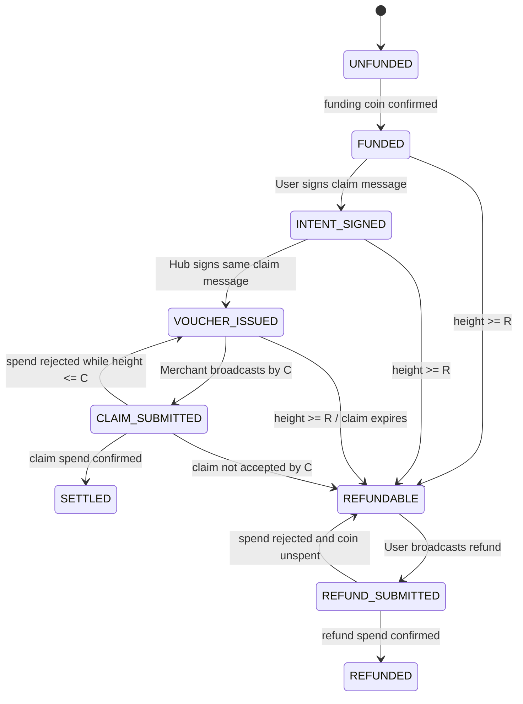

# Wall-Hub V1 State Machine

Status: **FROZEN FOR MVP IMPLEMENTATION**

The database records observations and signed artifacts. It does not override
the authoritative spent/unspent status of the funding coin.

## Lifecycle

## State invariants

| State | Required invariant |
|---|---|
| `UNFUNDED` | No confirmed funding coin is associated with the channel |
| `FUNDED` | Funding coin is confirmed and unspent; no User claim signature exists |
| `INTENT_SIGNED` | Valid User signature exists; valid Hub claim signature does not |
| `VOUCHER_ISSUED` | User and Hub signatures verify over the same claim message |
| `CLAIM_SUBMITTED` | A claim transaction id is stored; payment is not yet final |
| `SETTLED` | Chain confirms Merchant 1 mojo and User 9 mojos outputs |
| `REFUNDABLE` | Height is at least `R = C + 1`, funding coin is unspent, and claim is expired |
| `REFUND_SUBMITTED` | A refund transaction id is stored; refund is not yet final |
| `REFUNDED` | Chain confirms the User 10 mojos output |

`SETTLED` and `REFUNDED` are mutually exclusive terminal states.

## Payment display rule

Merchant status is derived as follows:

| Condition | Merchant display state |
|---|---|
| Invoice valid, no User signature | `PENDING` |
| User signed, Hub signature missing | `PENDING_HUB` |
| Both signatures valid and current height <= payment expiry | `PAID_OFFCHAIN` |
| Payment expiry passed without a valid Voucher | `EXPIRED` |
| Refund height `R` reached before claim confirmation | `CLAIM_EXPIRED` |
| Claim confirmed | `SETTLED` |

## Uniqueness and atomicity

The persistence layer MUST enforce:

- unique `channel_id`;
- unique `(channel_id, order_id)`;
- unique `(channel_id, nonce)`;
- at most one Voucher for a V1 channel;
- compare-and-swap or serializable transaction semantics for state changes;
- durable storage of both individual signatures before returning
  `VOUCHER_ISSUED`.

## Error codes

| Code | Meaning |
|---|---|
| `INVALID_FIELD_LENGTH` | A fixed-width field has the wrong length |
| `UNSUPPORTED_VERSION` | Protocol version is not 1 |
| `WRONG_NETWORK` | Genesis challenge or consensus domain does not match |
| `WRONG_FUNDING_COIN` | Voucher is bound to another coin |
| `WRONG_CHANNEL` | Derived channel id does not match |
| `INVALID_SIGNATURE` | A required BLS signature fails verification |
| `PAYMENT_EXPIRED` | Payment signing deadline has passed |
| `CLAIM_WINDOW_TOO_SHORT` | Fewer than 20 blocks remain after payment expiry |
| `CLAIM_EXPIRED` | Current simulator height is at least `R` |
| `DUPLICATE_ORDER` | Order id was previously accepted in the channel |
| `DUPLICATE_NONCE` | Nonce was previously accepted in the channel |
| `CHANNEL_ALREADY_COMMITTED` | A V1 Voucher already exists |
| `ILLEGAL_STATE_TRANSITION` | Requested transition is not in the lifecycle |
| `FUNDING_COIN_SPENT` | Chain reports that the channel already reached a terminal spend |

## Recovery rule

After restart, the service MUST load the durable state and then reconcile the
funding coin against the chain:

1. If unspent, keep or repair the nonterminal local state.
2. If spent to the exact claim outputs, set `SETTLED`.
3. If spent to the exact refund output, set `REFUNDED`.
4. If spent in any other way, set a fatal reconciliation error and stop signing.
